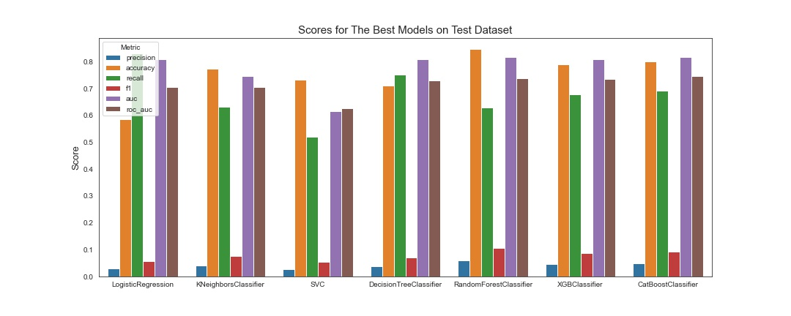

# Travel Insurance Claim Prediction
Abeselom Fanta Flex 20 Weeks Instructor: Abhineet Kulkarni

## Business Understanding

This project aims to build a predictive model that can predict whether a travel insurance claim is is approved or denied base on the data provided. The data was collected by a third-party travel insurance servicing company that is based in Singapore. The type of data include claim status, agency name, type of travel insurance agency, distribution channel of travel insurance agencies, name of the travel insurance products, duration of travel, destination of travel, amount of sales of travel insurance policies, commission received for travel insurance agency, gender of insured and age of insured. Insurance claims often involve complex decision, which can be costly to the insurers as well as the insured. Therefor, an automated method to screen claims saves time and valuable resources. 

## Data Understanding

The data used in this project was sourced from [Kaggle](https://www.kaggle.com/mhdzahier/travel-insurance) based on a third-party travel insurance servicing company that is based in Singapore. Although there is no mention of date on which the data was collected, based on the nature of destination, it is assumed to be collected in the mid with in the last 12 years. The data covers above 63 thousand travel insurance claims, which is very comprehensive. 

The data has an inordinate amount of class imbalance with only 1.5% of the claims approved. Therefore, class weight and oversampling techniques were used in the project to address the class imbalance. This can be addressed using class weighting in the model or oversampling. For oversampling, the models were cross-validated with SMOTE, ADASYN and RandomOverSample. The models used in this project are logistic regression, k-nearest neighbors, support vector machine, decision tree, random forest, and gradient boosting methods: `XGBoost` and `CatBoost`.  

There are 10 features in the data set, with only 9 selected for use. Additional simplification steps, such as replacing destination countries by continents were used to reduce the amount of columns used for processing.   Categorical variables such as agency name, type and product names were one hot encoded. In addition, for this project, a reusable custom grid search class was written which works well with almost all of libraries used for machine learning. The overall distributions of numerical and categorical data included in the source are show with plots below.


## Modeling

In this project, data with negative age, commission and net sales were omitted from analysis. Gender of applicants were also removed due to missing values. The number of claims approved by different agencies is significantly small compared to the those which were not approved. Therefore, maximizing true positive rates, in other words instances where claims are approved, was chosen as an important metric to evaluate the set of models. Including all destinations in the modeling process resulted in a very large dataset. Therefore, destination countries were replaced by continents instead. The following map shows the frequency at which claim requests were made (excluding Singapore which had over 13,000 claims filed). 


For this particular problem, a total of seven machine learning modeling techniques were used. The following table summarizes the number of models used in this project. Training these models takes a long time. Therefore, the pretrained models are saved and can be downloaded from [this link](https://drive.google.com/file/d/1-35hJfJi4Z8ahXzGrHPJfPpMSibErAHx/view?usp=drivesdk).  

| LogisticRegression | KNeighborsClassifier | SVC | DecisionTree | RandomForest | XGBoost | CatBoost |
| --- | --- | --- | --- | --- | --- | --- |
| 40 | 12 | 18 | 242 | 2178 | 750 | 960 |


## Results 

Each type of model was cross validated with class imbalance considered and three oversampling techniques: SMOTE, ADASYN and randomized. Among the list of models considered for each modeling technique, the best models (models with highest true positive rates) were selected and compared with each other. The following graph shows the comparison between the best models chosen.



Although Random Forest had the best accuracy, `CatBoost` performed better at discriminating true positive cases. A few variations based on the final `CatBoost` data were made, by either selecting features that influence the model the most or considering destinations (not continents) as features. The following plots show the important features identified for the two approaches mentioned. 


After comparing four variants of the final `CatBoost` model, the ultimate model was chosen based on the number of true positives predicted, accuracy and precision. The final model was then saved to file for a web deployed version of the application. The comparison of these variants is showed blow. 


The screen grab of the web interface is displayed below. Users are asked to enter values and will be prompted if their claim application is approved or denied. The web service can be activated by typing to `python app.py` into the command prompt and going to [this link](http://localhost:5000).


## Conclusion

Random Forest and `CatBoost` classifiers models showed strong performance. Logistic regression was also surprisingly effective with descent accuracy.  Using `CatBoost`, 80% of the true negative and 69% of the true positive rates were captured. This metrics is, however, subjected to change based on the criterion set by the firm (i.e., if more applications need to be rejected). 

Only a handful of features, namely, agents (C2B, LWC and EPX), products (2 Way Comprehensive Plan, Cancellation Plan and Single Trip Travel Protect Gold), destination continents (Asia and North and Central America), age, commission, duration, and net sales were identified as important features. Retraining the model based on these features alone resulted in a model that can the true positive rate better than the final model. This also liable to change based on preferences. If accuracy is favored, the results will change significantly. If the models are downloaded from the given link, anyone can run the models with accuracy as the major metric for evaluation.  

It was hoped that encoding all destinations yields better results. The output shows that the contrary is true. Therefore, replacing destination countries with continents could help make better predictions. Generally, gradient boosting provides good models that can be used in the field. 

## Next Steps

To make better predictions, more data is required with even more destinations. The would also mean a balanced claim approval to denial ratio can help improve the proficiency of prediction. As mentioned earlier, gender was skipped from processing due to the large number of missing entries. Including more features aides with better predictions. Lastly, time was not referenced in the data. Travel insurances often change based on the most common tourist attractions or stability of the destination countries. Adding key information, such as date at which claims are made, helps in developing models that can prognosticate. 

## For More Information

See the full analysis in the [Jupyter Notebook](./index.ipynb) or review this [presentation](./presentation.pdf).

For additional info, contact the author at [afanta@alumni.cmu.edu](mailto:afanta@alumni.cmu.edu)

## Repository Structure

```
├── images
├── data
├── static
├── template
├── README.md
├── presentation.pdf
├── summary.pickle
├── app.py
├── index.ipynb
└── model.pickle (download from https://drive.google.com/file/d/1-35hJfJi4Z8ahXzGrHPJfPpMSibErAHx/view?usp=drivesdk)